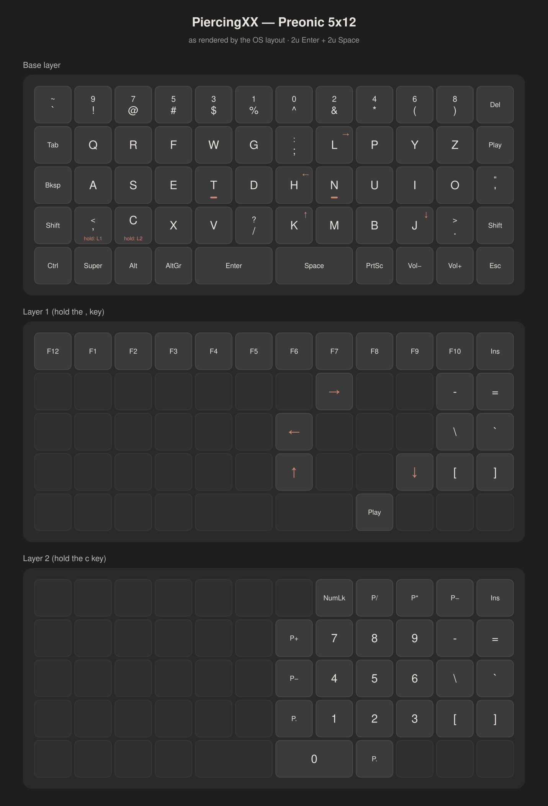
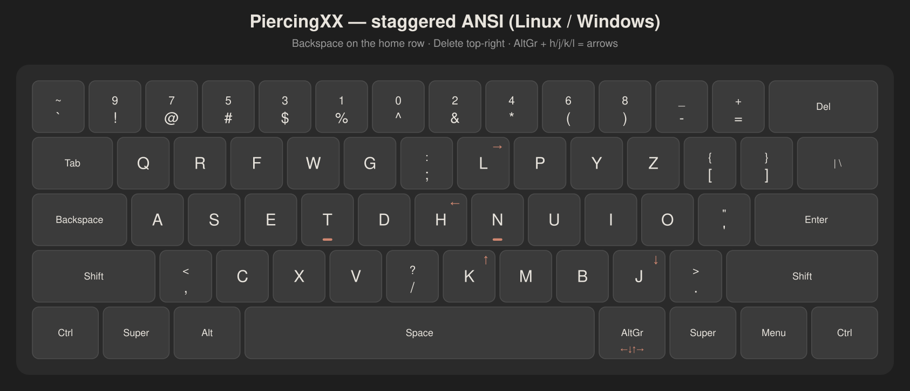
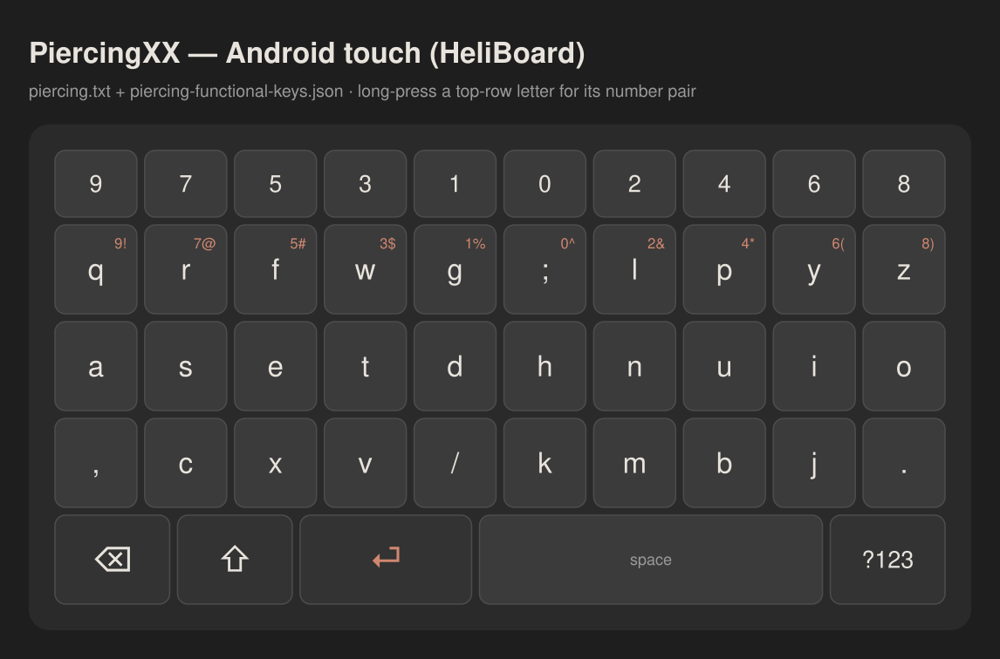

# Piercing Keyboard Layout

My personal layout designed by what works for me. No one else will touch this but that is not why its here.

One layout,every platform: Linux (X11 + Wayland), Windows, Android/GrapheneOS, and QMK/Vial ortholinear boards.

```
`~   !9   @7   #5   $3   %1   ^0   &2   *4   (6   )8   -_   =+   Del
Tab   q    r    f    w    g    ;:   l    p    y    z    [{   ]}   \|
Bksp  a    s    e    t    d    h    n    u    i    o    '"       Enter
Shft  ,<   c    x    v    /?   k    m    b    j    .>            Shft
Ctrl  Super  Alt         [ Space ]        AltGr  Super  Menu  Ctrl
```

## Design

- **Home row `a s e t d h n u i o`** 
- **Number row: symbols unshifted, digits on Shift.** Digits run odd-left /
  even-right radiating out from the center (`9 7 5 3 1 | 0 2 4 6 8`), so
  consecutive digits alternate hands.
- **Backspace where it should be** (the old Caps Lock key) — the most-used
  editing key on the strongest position. **Delete** takes the old Backspace
  corner. There is no Caps Lock.
- **AltGr + h/j/k/l = ← ↓ ↑ →** — vim arrows that follow the *letters*,
  wherever they live on the board.
- Measured ~3.3% same-finger bigrams on English text (QWERTY ~7.6%,
  Colemak ~1.6%).

Everything is **position-based**: keyboards send standard scancodes and the
OS layout does the remapping, so any keyboard works on any device and there
is exactly one source of truth per OS. Works identically on row-staggered
and ortholinear boards.

## Visual reference

### Ortholinear 5×12 (Preonic, 2u Enter + 2u Space) — base + layers



### Staggered ANSI (laptop / desktop)



### Android touch keyboard (HeliBoard)



## Install

### Linux (X11 and Wayland) — `linux/`

```sh
./linux/install.sh
```

Installs to `~/.config/xkb/` (user-level — survives system updates) and
verifies the layout compiles. Nothing activates until you select it:

| Environment | How to enable |
|---|---|
| GNOME / KDE (Wayland) | add input source "English (Piercing)" (re-login first) |
| sway | `input type:keyboard xkb_layout piercing` |
| Hyprland | `input { kb_layout = piercing }` |
| X11 | `setxkbmap -I$HOME/.config/xkb piercing -print \| xkbcomp -I$HOME/.config/xkb - $DISPLAY` |

### Linux phones (Phosh / Squeekboard) — `linux/squeekboard/`

On-screen keyboard layouts for Phosh phones (Furi, PinePhone, Librem 5),
based on the furi-phone-colemak-keyboard structure. Includes portrait +
landscape (`_wide`) variants of the base layout plus `terminal/` (Ctrl,
Alt, Tab, arrows, F-keys), `email/` (@ key), and `url/` (/ key) hint
variants. Bottom row everywhere: Backspace · Shift · prefs · Enter ·
space · 123 — Enter left of space (~1:2 Enter:space split), same thumb
order as the Preonic.

Run **on the phone**, inside the Phosh session:

```sh
./linux/install.sh              # xkb layout first (defines the input source)
./linux/squeekboard/install.sh  # copies layouts, enables the input source
```

### Windows — `windows/`

1. Build `piercing.klc` with [MSKLC 1.4](https://www.microsoft.com/en-us/download/details.aspx?id=102134):
   Project → Build DLL and Setup Package → run the generated installer →
   select "English (Piercing)" in Settings → Time & Language.
2. Run `install.ps1` as Administrator — applies the Caps→Backspace and
   Backspace→Delete scancode remaps and autostarts the AltGr-arrows script
   (needs [AutoHotkey v2](https://www.autohotkey.com)). Reboot once.

### Android / GrapheneOS — `android/`

**Touch keyboard.** Google's Gboard has no mechanism for loading custom
layouts — its closest built-in is stock Colemak, and that is a hard limit
of Gboard itself. Use [HeliBoard](https://github.com/Helium314/HeliBoard)
(F-Droid, works great on GrapheneOS):

1. HeliBoard Settings → Languages & Layouts → English → **+** →
   load `android/heliboard/piercing.txt`.
2. Settings → Layouts → Functional keys → add custom →
   load `android/heliboard/piercing-functional-keys.json`. This clears the
   cramped Shift/Backspace off the letter row and makes the bottom row
   `⌫ · ⇧ · ⏎ · space · ?123` (Enter left of a ~1:2 space, like the
   Preonic).
3. Long-press any top-row letter for that column's number-row pair
   (e.g. long-press `q` → `9` / `!`).
4. Optional: enable Settings → Preferences → Number row. HeliBoard can
   even reorder it to `9 7 5 3 1 0 2 4 6 8` via a custom
   `[number_row]` section — see HeliBoard's
   [layouts.md](https://github.com/Helium314/HeliBoard/blob/main/layouts.md).

**Physical keyboards** (USB/BT): build the tiny APK in
`android/hardware-keyboard/` (open in Android Studio or run
`gradle assembleRelease`; sideload on GrapheneOS), then
Settings → System → Physical keyboard → "English (Piercing)".
Includes the full layout, Backspace/Delete remaps, and AltGr arrows.

### Preonic / QMK ortho boards — `ortho-5x12/`

For a Drop Preonic rev3 running Vial firmware, `preonic-vial/apply-piercing.py`
writes the keymap over USB — instant, no reflash, fully reversible:

```sh
./apply-piercing.py                  # dry run: show pending changes
./apply-piercing.py --apply          # write to the board
./apply-piercing.py --dump my.bin    # back up the current keymap first!
./apply-piercing.py --restore my.bin # put a backup back
```

The board keeps sending standard positions (the OS layout remaps), with:

- **Layer 1** (hold the `,` key): F1–F12, vim arrows on the h/j/k/l letter
  keys, `- = \ ` [ ]` symbol column
- **Layer 2** (hold the `c` key): numpad (digits encoded to survive the
  Piercing number row) and the same symbol column
- **AltGr thumb key** (4th bottom-left) — OS-level vim arrows, same finger
  positions as Layer 1
- Bottom row: Ctrl · Super · Alt · AltGr · Enter(2u) · Space(2u) · PrtSc ·
  Vol− · Vol+ · Esc

`qmk/keymap.c` is a compile-ready mirror for non-Vial QMK builds, and
`kle-piercing-5x12.json` imports into
[keyboard-layout-editor.com](https://keyboard-layout-editor.com).

## Switching (and switching back)

1. Preonic: `apply-piercing.py --dump backup.bin && apply-piercing.py --apply`
2. Linux: select "English (Piercing)" as input source
3. Windows / Android: install as above, pick the layout

Roll back anytime: `--restore backup.bin` on the board, re-select your old
layout in each OS, delete the `Scancode Map` registry value on Windows.

## Repository layout

```
images/                       per-device diagrams (PNG)
linux/                        xkb symbols + rules + install.sh
linux/squeekboard/            Phosh phone OSK layouts + install.sh
windows/                      MSKLC .klc, scancode-remap.reg, AltGr .ahk, install.ps1
android/heliboard/            touch-keyboard layout + functional keys json
android/hardware-keyboard/    KCM layout APK project (physical keyboards)
ortho-5x12/                   Preonic: Vial apply/restore tool, QMK mirror, KLE
```

## License

MIT — see [LICENSE](LICENSE).
