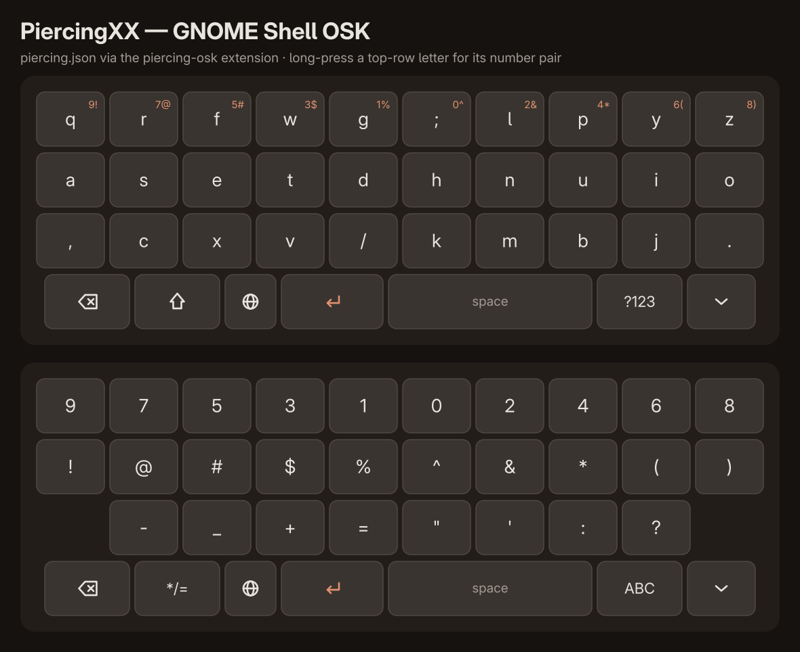

# Piercing Keyboard Layout

My personal layout designed by what works for me. No one else will touch this but that is not why its here.

One layout, every platform: Linux (X11 + Wayland), Windows, macOS, Android/GrapheneOS, and QMK/Vial/ZMK ortholinear boards.

```
`~   !9   @7   #5   $3   %1   ^0   &2   *4   (6   )8   -_   =+   Del
Tab   q    r    f    w    g    ;:   l    p    y    z    [{   ]}   \|
Bksp  a    s    e    t    d    h    n    u    i    o    '"       Enter
Shft  ,<   c    x    v    /?   k    m    b    j    .>            Shft
Ctrl  Super  Alt         [ Space ]        AltGr  Super  Menu  Ctrl
```

## Design

- **Home row `a s e t d h n u i o`** 
- **Number row: symbols unshifted, digits on Shift.** Digits run odd-left /
  even-right radiating out from the center (`9 7 5 3 1 | 0 2 4 6 8`), so
  consecutive digits alternate hands.
- **Backspace where it should be** (the old Caps Lock key) — the most-used
  editing key on the strongest position. **Delete** takes the old Backspace
  corner. There is no Caps Lock.
- **The top-right key is always Delete**, on every board. On the smaller
  boards that means Delete keeps the corner and the media key is what
  gets dropped to a layer — not the reverse. A layout that shuffles
  Delete around per board defeats the point of one layout everywhere.
- **AltGr + h/j/k/l = ← ↓ ↑ →** — vim arrows that follow the *letters*,
  wherever they live on the board.
- Measured ~3.3% same-finger bigrams on English text (QWERTY ~7.6%,
  Colemak ~1.6%).

Everything is **position-based**: keyboards send standard scancodes and the
OS layout does the remapping, so any keyboard works on any device and there
is exactly one source of truth per OS. Works identically on row-staggered
and ortholinear boards.

## Visual reference

### Ortholinear 5×12 (Preonic, 2u Enter + 2u Space) — base + layers


### Staggered ANSI (laptop / desktop)


### Android touch keyboard (HeliBoard)


### GNOME Shell on-screen keyboard



## Install

### Linux (X11 and Wayland) — `linux/`

```sh
./linux/install.sh
```

Installs to `~/.config/xkb/` (user-level — survives system updates) and
verifies the layout compiles. **Nothing activates until you select it** —
until then every keyboard you plug in keeps typing whatever layout the
session is already on, no matter what its firmware says.

#### Wayland compositors

One line each, dropped into the config the installer left alone:

| WM | File | Line to add |
|---|---|---|
| GNOME | — | `gsettings set org.gnome.desktop.input-sources sources "[('xkb', 'piercing')]"` |
| KDE | — | System Settings → Keyboard → Layouts → add "English (Piercing)" |
| Hyprland | `~/.config/hypr/hyprland.conf` | `input { kb_layout = piercing }` |
| sway | `~/.config/sway/config` | `input type:keyboard xkb_layout piercing` |
| river | `~/.config/river/init` | `riverctl keyboard-layout piercing` |
| niri | `~/.config/niri/config.kdl` | `input { keyboard { xkb { layout "piercing" } } }` |
| qtile (Wayland) | `~/.config/qtile/config.py` | `wl_input_rules = {"type:keyboard": InputConfig(kb_layout="piercing")}` |

**Clear the variant at the same time.** `piercing` is a layout, not a
variant of `us`, so a leftover `kb_variant = "colemak"` (or
`xkb_variant`) makes the compositor look for `piercing(colemak)`, which
doesn't exist — it falls back and you keep typing the old layout while
the config *looks* correct. Set the variant to `""`.

Leave `kb_options = "caps:backspace"` alone if you have it. The Piercing
symbols file already binds Caps to Backspace, so it is redundant *under
Piercing* — but the ortho boards send `KC_CAPS` from that key by design
(see [Backspace and Delete](#backspace-and-delete-are-remapped-by-the-os-not-the-firmware)),
so the option is what keeps it working whenever you switch to another
layout.

If your compositor config is generated (Lua, Nix, a templating script),
edit the generator rather than the emitted file — e.g. Hyprland configs
built with `hl.config{}` keep these keys in an `input = { ... }` table.
To test before committing to it, Hyprland applies changes live:

```sh
hyprctl keyword input:kb_layout piercing && hyprctl keyword input:kb_variant ""
```

#### X11 window managers

All of them take the *same* one-liner — only the file it goes in changes:

```sh
setxkbmap -I$HOME/.config/xkb piercing -print | xkbcomp -I$HOME/.config/xkb - $DISPLAY
```

The `-I$HOME/.config/xkb` flags are what make X11 look in the user-level
directory; plain `setxkbmap piercing` fails with "cannot find layout"
unless the layout is installed system-wide.

| WM | File | Line to add |
|---|---|---|
| i3 | `~/.config/i3/config` | `exec_always --no-startup-id setxkbmap -I$HOME/.config/xkb piercing -print \| xkbcomp -I$HOME/.config/xkb - $DISPLAY` |
| bspwm | `~/.config/bspwm/bspwmrc` | `setxkbmap -I$HOME/.config/xkb piercing -print \| xkbcomp -I$HOME/.config/xkb - $DISPLAY` |
| herbstluftwm | `~/.config/herbstluftwm/autostart` | `setxkbmap -I$HOME/.config/xkb piercing -print \| xkbcomp -I$HOME/.config/xkb - $DISPLAY` |
| dwm | `~/.config/dwm/autostart.sh` | `setxkbmap -I$HOME/.config/xkb piercing -print \| xkbcomp -I$HOME/.config/xkb - $DISPLAY` |
| awesome | `~/.config/awesome/rc.lua` | `awful.spawn.with_shell("setxkbmap -I$HOME/.config/xkb piercing -print \| xkbcomp -I$HOME/.config/xkb - $DISPLAY")` |
| qtile (X11) | `~/.config/qtile/config.py` | `subprocess.run("setxkbmap -I$HOME/.config/xkb piercing -print \| xkbcomp -I$HOME/.config/xkb - $DISPLAY", shell=True)` in a `@hook.subscribe.startup_once` |
| any / .xinitrc | `~/.xinitrc` | same line, before the `exec <wm>` |

In i3, bspwm, herbstluftwm and dwm the line runs through a shell, so the
pipe works as written. Use `exec_always` (not `exec`) in i3 so the layout
survives a config reload.

#### Console and login screen

The commands above only cover your graphical session. To cover TTYs and
the display manager too, use the keyd route in `linux/keyd/` instead —
and if you do, set the session input source back to plain "English (US)",
since keyd plus the piercing xkb layout would remap letters twice.

### Linux phones (Phosh / Squeekboard) — `linux/squeekboard/`

On-screen keyboard layouts for Phosh phones (Furi, PinePhone, Librem 5),
based on the furi-phone-colemak-keyboard structure. Includes portrait +
landscape (`_wide`) variants of the base layout plus `terminal/` (Ctrl,
Alt, Tab, arrows, F-keys), `email/` (@ key), `url/` (/ key), and
`number/` + `pin/` (digit pads in the Piercing `9 7 5 3 1 0 2 4 6 8`
order) hint variants. Bottom row everywhere: Backspace · Shift · prefs · Enter ·
space · 123 — Enter left of space (~1:2 Enter:space split), same thumb
order as the Preonic.

Run **on the phone**, inside the Phosh session:

```sh
./linux/install.sh              # xkb layout first (defines the input source)
./linux/squeekboard/install.sh  # copies layouts, enables the input source
```

### GNOME on-screen keyboard (touch) — `linux/gnome-osk/`

The OSK layout GNOME Shell pops up on touch screens (tablets, 2-in-1s)
when the "English (Piercing)" input source is active. Same touch
adaptation as Squeekboard/HeliBoard: three 10-key ortho rows, long-press
a top-row letter for its number-row pair (q → 9/!), `?123` level with the
`9 7 5 3 1 0 2 4 6 8` digit order, and a bottom row of
⌫ · ⇧ · 🌐 · ⏎ · space · ?123 with a 1:2 Enter:space split.

GNOME loads OSK layouts from a compiled resource bundle keyed by xkb
layout name, with no user-level override path — so the installer ships a
tiny shell extension that registers an extra bundle containing
`piercing.json` at runtime. User-level, no sudo, survives gnome-shell
updates:

```sh
./linux/install.sh           # xkb layout first (defines the input source)
./linux/gnome-osk/install.sh # build + install the piercing-osk extension
```

Log out/in so gnome-shell picks up the extension. If extensions are
disabled on the machine, `install-system.sh` instead patches the system
bundle directly (sudo, backs up to `*.orig`, re-run after gnome-shell
updates).

### Linux system-wide (GDM, TTYs, all compositors) — `linux/keyd/`

An alternative to the xkb approach: [keyd](https://github.com/rvaiya/keyd)
remaps at the evdev level, so the layout (including the number-row
symbol/digit swap, Caps→Backspace, Backspace→Delete, and AltGr arrows)
works at the login screen, in virtual consoles, and under any compositor,
for every user:

```sh
sudo pacman -S keyd        # or: apt install keyd
./linux/keyd/install.sh    # installs /etc/keyd/default.conf, reloads keyd
```

**Use one or the other**: with keyd active, set the session's input
source back to plain "English (US)" — keyd + the piercing xkb layout
together would remap letters twice. On-screen keyboards bypass keyd, so
touch-first devices should stay on the xkb + OSK setup instead.

`pocket-reform.conf` is the ortho-5x12 layout adapted to the MNT Pocket
Reform's internal keyboard + trackball (USB id `1209:6d06` — it only ever
matches that device). The bottom-left ○ key is firmware-local, so the mod
block sits one key right of the Preonic's; both Space keys share one
scancode, so Enter lives on the outer-left trackball button (L1+Space as
fallback). Deployment kit for the device itself: the `mnt-pocket-reform`
repo.

### Windows — `windows/`

1. Build `piercing.klc` with [MSKLC 1.4](https://www.microsoft.com/en-us/download/details.aspx?id=102134):
   Project → Build DLL and Setup Package → run the generated installer →
   select "English (Piercing)" in Settings → Time & Language.
2. Run `install.ps1` as Administrator — applies the Caps→Backspace and
   Backspace→Delete scancode remaps and autostarts the AltGr-arrows script
   (needs [AutoHotkey v2](https://www.autohotkey.com)). Reboot once.

### macOS — `macos/`

```sh
./macos/install.sh
```

Installs `piercing.keylayout` to `~/Library/Keyboard Layouts` (select it
under System Settings → Keyboard → Input Sources → Others → Piercing;
log out/in if it doesn't appear), plus a LaunchAgent that applies the
Caps→Backspace and Backspace→Delete remaps via `hidutil` at login. If
[Karabiner-Elements](https://karabiner-elements.pqrs.org) is installed,
the AltGr-arrows rule is copied too — enable "Piercing AltGr arrows"
under Complex Modifications (right Option is the AltGr key).

### Android / GrapheneOS — `android/`

**Touch keyboard.** Google's Gboard has no mechanism for loading custom
layouts — its closest built-in is stock Colemak, and that is a hard limit
of Gboard itself. Use [HeliBoard](https://github.com/Helium314/HeliBoard)
(F-Droid, works great on GrapheneOS):

1. HeliBoard Settings → Languages & Layouts → English → **+** →
   load `android/heliboard/piercing.txt`.
2. Settings → Layouts → Functional keys → add custom →
   load `android/heliboard/piercing-functional-keys.json`. This clears the
   cramped Shift/Backspace off the letter row and makes the bottom row
   `⌫ · ⇧ · ⏎ · space · ?123` (Enter left of a ~1:2 space, like the
   Preonic).
3. Long-press any top-row letter for that column's number-row pair
   (e.g. long-press `q` → `9` / `!`).
4. Optional: enable Settings → Preferences → Number row. HeliBoard can
   even reorder it to `9 7 5 3 1 0 2 4 6 8` via a custom
   `[number_row]` section — see HeliBoard's
   [layouts.md](https://github.com/Helium314/HeliBoard/blob/main/layouts.md).

**Physical keyboards** (USB/BT): build the tiny APK in
`android/hardware-keyboard/` (open in Android Studio or run
`gradle assembleRelease`; sideload on GrapheneOS), then
Settings → System → Physical keyboard → "English (Piercing)".
Includes the full layout, Backspace/Delete remaps, and AltGr arrows.

### Preonic / QMK ortho boards — `ortho-5x12/`

For a Drop Preonic rev3 running Vial firmware, `preonic-vial/apply-piercing.py`
writes the keymap over USB — instant, no reflash, fully reversible:

```sh
./apply-piercing.py                  # dry run: show pending changes
./apply-piercing.py --apply          # write to the board
./apply-piercing.py --dump my.bin    # back up the current keymap first!
./apply-piercing.py --restore my.bin # put a backup back
```

The board keeps sending standard positions (the OS layout remaps), with:

- **Layer 1** (hold the `,` key): F1–F12, vim arrows on the h/j/k/l letter
  keys, `- = \ ` [ ]` symbol column
- **Layer 2** (hold the `c` key): numpad (digits encoded to survive the
  Piercing number row) and the same symbol column
- **AltGr thumb key** (4th bottom-left) — OS-level vim arrows, same finger
  positions as Layer 1
- Bottom row: Ctrl · Super · Alt · AltGr · Enter(2u) · Space(2u) · PrtSc ·
  Vol− · Vol+ · Esc

`qmk/keymap.c` is a compile-ready mirror for non-Vial QMK builds, and
`kle-piercing-5x12.json` imports into
[keyboard-layout-editor.com](https://keyboard-layout-editor.com).

### Blank Slate / Planck / minipeg48 4×12 — `ortho-4x12/`

The Preonic layout minus its number row: the lower four rows carry over
unchanged (same 2u Enter + 2u Space thumb cluster), and a third hold-key
joins the `,`=L1 / `c`=L2 pattern on the key that types `x`:

- **Layer 3** (hold the `x` key): the missing number row (`` `~ `` +
  symbols/digits + Del) and F-row (F12 F1–F10 Ins). Shift passes
  through, so Shift + top row types digits exactly like the Preonic.
- Layers 1 and 2 (arrows/symbols, numpad) are identical to the Preonic's.

**LP Galaxy Blank Slate (ZMK, nRF52840)** — `ortho-4x12/zmk/` is a
complete zmk-config (ZMK v0.3 + the blank-slate module, 2×2u physical
layout). Pushing changes under `ortho-4x12/zmk/` runs the
`zmk-blank-slate` GitHub Actions workflow, which builds two firmware
artifacts: plain and ZMK Studio-enabled. To flash: double-tap reset,
then copy the `.uf2` onto the UF2 drive that appears (grab the drive's
`CURRENT.UF2` first — it is a backup of the firmware currently on the
board). On layer 3 the right hand of the letter row has Bluetooth
profile (1–3), BT clear, and USB/BLE output-toggle keys.

**Planck rev6/7 (QMK)** — import `ortho-4x12/qmk/piercing-planck-rev7.json`
at [config.qmk.fm](https://config.qmk.fm), compile, and flash the built
firmware with QMK Toolbox. `ortho-4x12/qmk/keymap.c` is the same keymap
as compile-ready source (`LAYOUT_planck_2x2u`).

**sporewoh minipeg48 (Vial)** — `ortho-4x12/vial/apply-piercing.py` writes
the keymap over USB, exactly like the Preonic tool:

```sh
./apply-piercing.py                  # dry run: show pending changes
./apply-piercing.py --apply          # write to the board
./apply-piercing.py --dump my.bin    # back up the current keymap first!
./apply-piercing.py --restore my.bin # put a backup back
```

Its matrix is a plain 4×12 grid even though the board is built 2×2u, so
only one switch is wired under each 2u cap. Which half of a slot pair is
live can't be read over HID, so the bottom row keeps Enter on slots 4/5/6
and Space on slot 7 — the assignment already proven working on the board.

`kle-piercing-4x12.json` imports into
[keyboard-layout-editor.com](https://keyboard-layout-editor.com).

### Charybdis 3×6 — `charybdis-3x6/`

The 41-key BastardKB split with a trackball. Its 3×6 letter block is
exactly the Planck's lower three rows, so every letter and layer key
keeps its position; only the 5 thumbs differ from the Planck's 10 bottom-
row functions. Layer 3 absorbs the overflow — number row, F-row, media,
and the pointer block (sniping, drag-scroll, DPI, mouse buttons).

Import `piercing-charybdis-3x6.layout.json` in Vial (File → Import
Keymap). See [`charybdis-3x6/README.md`](charybdis-3x6/README.md) for the
two deliberate deviations the key count forces.

## The numpad layers assume the Piercing OS layout

The keyboards send standard positions and the OS does the remapping — but
the ortho numpad layers are the one place where firmware has to *know*
which OS layout is active. Because Piercing puts digits on Shift, a
numpad key that sent a plain `KC_7` would type `&`, so those layers send
Shift+position instead: `7` is Shift+`2`, `9` is Shift+`1`, and so on.

The consequence is worth knowing before you go hunting for a hardware
fault: **run one of these boards while the session is still on QWERTY or
Colemak and the numpad types symbols instead of digits.** That is the
encoding working correctly against the wrong layout, not a broken keymap.
Same story in reverse for the layer-3 number row — it deliberately gives
symbols unshifted and digits on Shift, exactly like the Preonic's
physical number row.

If the numpad is producing `@ # $` where digits should be, check the
session's active layout (`hyprctl devices -j`, `swaymsg -t get_inputs`,
`setxkbmap -query`, `gsettings get org.gnome.desktop.input-sources
sources`) before touching the board.

### Backspace and Delete are remapped by the OS, not the firmware

Same trap, sharper edge. The xkb layout does this:

| Firmware sends | Renders as |
|---|---|
| `KC_CAPS` | **BackSpace** |
| `KC_BSPC` | **Delete** |
| `KC_DEL` | Delete |

So a programmable board must send **`KC_CAPS`** from the home-row-left
key, not `KC_BSPC`. Sending `KC_BSPC` there looks obviously right and is
wrong: xkb turns it into Delete, leaving you with two Delete keys and no
Backspace at all. The remap belongs to the OS layout — the firmware's job
is only to put the *standard* scancode on the physical position, and the
standard scancode for the key left of `A` is Caps Lock.

This is the same double-remap the keymap headers warn about for letters;
it just bites harder because the failure is a dead Backspace rather than
a wrong letter. Every board in this repo sends `KC_CAPS` there.

Keep `caps:backspace` in your compositor's `kb_options` if you switch
between Piercing and other layouts — it makes that key behave under
QWERTY/Colemak too. Under Piercing alone it is redundant.

## Switching (and switching back)

1. Preonic / minipeg48: `apply-piercing.py --dump backup.bin && apply-piercing.py --apply`
2. Linux: select "English (Piercing)" as input source
3. Windows / macOS / Android: install as above, pick the layout

Roll back anytime: `--restore backup.bin` on the board, re-select your old
layout in each OS, delete the `Scancode Map` registry value on Windows.

## Repository layout

```
images/                       per-device diagrams (PNG)
linux/                        xkb symbols + rules + install.sh
linux/squeekboard/            Phosh phone OSK layouts + install.sh
linux/gnome-osk/              GNOME Shell OSK layout, extension + system installers
linux/keyd/                   system-wide evdev remap (GDM/TTY/all compositors)
                              + MNT Pocket Reform internal keyboard/trackball map
macos/                        .keylayout, hidutil LaunchAgent, Karabiner rule, install.sh
windows/                      MSKLC .klc, scancode-remap.reg, AltGr .ahk, install.ps1
android/heliboard/            touch-keyboard layout + functional keys json
android/hardware-keyboard/    KCM layout APK project (physical keyboards)
ortho-5x12/                   Preonic: Vial apply/restore tool, QMK mirror, KLE
ortho-4x12/                   Blank Slate (ZMK), Planck rev6/7 (QMK),
                              minipeg48 (Vial apply/restore tool), KLE
charybdis-3x6/                Charybdis 3x6: Vial keymap, QMK mirror, generator
```

## License

MIT — see [LICENSE](LICENSE).
